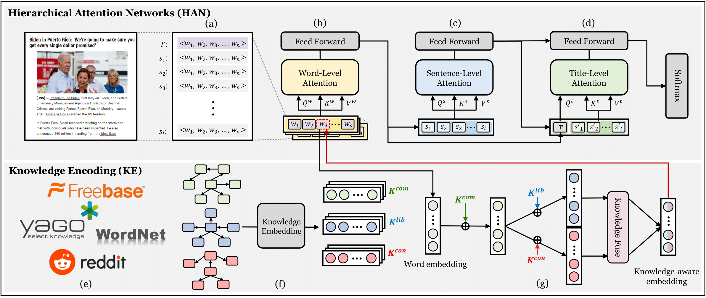

# [WWW'23] KHAN: Knowledge-Aware Hierarchical Attention Networks for Accurate Political Stance Prediction
This repository provides an implementation of *KHAN* as described in the paper: [KHAN: Knowledge-Aware Hierarchical Attention Networks for Accurate Political Stance Prediction](https://arxiv.org/pdf/2302.12126.pdf) by Yunyong Ko, Seongeun Ryu, Soeun Han, Youngseung Jeon, Jaehoon Kim, Sohyun Park, Kyungsik Han, Hanghang Tong, and Sang-Wook Kim, In *Proceedings of the ACM Web Conference* (WWW) 2023.

## The overview of KHAN


- Datasets
    - To reflect the different political knowledge of each entity, we build two political knowledge graphs, **KG-lib** and **KG-con**. Also, for extensive evaluation, we construct a large-scale political news datatset, **AllSides-L**, much larger (48X) than the existing largest political news article dataset.
- Algorithm
    - We propose a novel approach to accurate political stance prediction (**KHAN**), employing (1) hierarchical attention networks (HAN) and (2) knowledge encoding (KE) to effectively capture both explicit and implicit factors of a news article.
- Evaluation
    - Via extensive experiments, we demonstrate that (1) (_accuracy_) KHAN consistently achieves higher accuracies than all competing methods (up to 5.92% higher than the state-of-the-art method), (2) (_efficiency_) KHAN converges within comparable training time/epochs, and (3) (_effectiveness_) each of the main components of KHAN is effective in political stance prediction.

## Datasets
1. News articles datasets ([SemEval, AllSides-S, AllSides-L](https://drive.google.com/drive/u/2/folders/1ksV0PUncXyBnEHGPB4H4mae2ybXX3Ch0))

|Dataset|# of articles|Class distribution|
|:---:|:---:|:---:|
|SemEval|645|407 / 238|
|AllSides-S|14.7k|6.6k / 4.6k / 3.5k|
|AllSides-L|719.2k|112.4k / 202.9k / 99.6k / 62.6k / 241.5k|

2. Knowledge Graphs ([YAGO](https://paperswithcode.com/dataset/yago3-10), [KG-conservative, KG-liberal](https://drive.google.com/drive/u/2/folders/1DHlKOhKgISw9VTYmbMvnsIbaaLRtqhbq))

|KG dataset|# of source poses|# of entities|# of raltions|
|:---:|:---:|:---:|:---:|
|YAGO   | -       | 123,182 | 1,179,040|
|KG-lib | 219,915 | 5,581   | 29,967 |
|KG-con | 276,156 | 6,316   | 33,207 |


3. Pre-trained KG embeddings ([common, conservative, liberal](https://drive.google.com/drive/u/2/folders/14EgeI1RdSTccETqRgDd36writP6lUu1R))

## Dependencies
Our code runs on the Intel i7-9700k CPU with 64GB memory and NVIDIA RTX 2080 Ti GPU with 12GB, with the following packages installed:
```
python 3.8.10
torch 1.11.0
torchtext 0.12.0
pandas
numpy
argparse
sklearn
```

## How to run
```
python3 main.py \
  --gpu_index=0 \
  --batch_size=16 \
  --num_epochs=50 \
  --learning_rate=0.001 \
  --max_sentence=20 \
  --embed_size=256 \
  --dropout=0.3 \
  --num_layer=1 \
  --num_head=4 \
  --d_hid=128 \
  --dataset=SEMEVAL \
  --alpha=0.6 \
  --beta=0.2
```


## Citation
Please cite our paper if you have used the code in your work. You can use the following BibTex citation:
```
@inproceedings{ko2023khan,
  title={KHAN: Knowledge-Aware Hierarchical Attention Networks for Accurate Political Stance Prediction},
  author={Ko, Yunyong and Ryu, Seongeun and Han, Soeun and Jeon,Youngseung and Kim, Jaehoon and Park, Sohyun and Han, Kyungsik Tong, Hanghang and Kim., Sang-Wook},
  booktitle={Proceedings of the ACM Web Conference (WWW) 2023},
  pages={xxxx--xxxx},
  year={2023}
}
```
